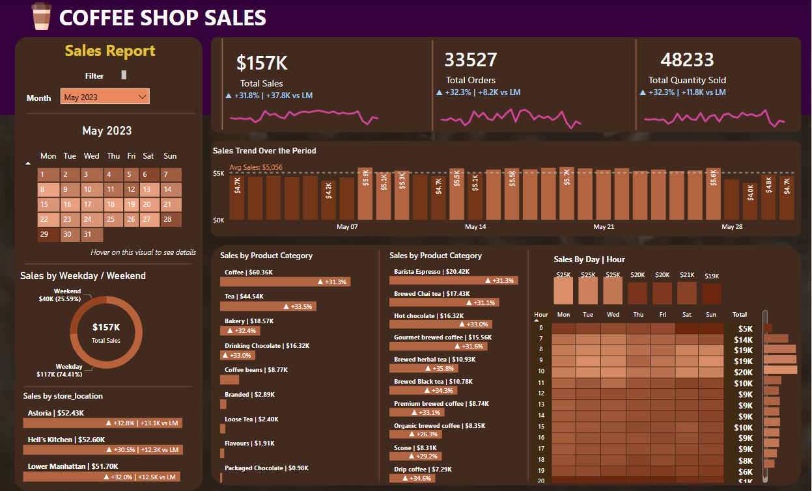

Coffee Shop Sales Project - MySQL + PowerBI

---------------------------------PROBLEM STATEMENT-------------------------------------------
I. KPI'S REQUIREMENTS
  1. Total Sales Analysis
     - Caculate the total sales for each respective month.
     - Determine the month-on-month increase or decrease in sales.
     - Calculate the difference in sales between the selected month and the previous month.
  2. Total Orders Analysis
     - Calculaate the total number of orders for easch respective month.
     - Determine the month-on-month increase or decrease in the number of orders.
     - Calculate the difference in the number of orders between the selected month and the previous month.
  3. Total Quantity Sold Analysis
     - Calulate the total quantity sold for each respective month.
     - Determine the month-on-month increasse or decreasae in the total quantity sold.
     - Calculate the difference in the total quantity sold between the selected month and the previous month.

II.  CHART'S REQUIREMENTS
  1. Calendar Heat Map:
     - Implement a calendar heat map that dynamically adjusts based on the selected month from a slicer.
     - Each day on the calendar will be color-coded to represent sales volume, with darker shades indicating higher sales
     - Implement tooltips to display detailed metrics (Sales, Orders, Quantity) when hovering over a specific day.
  2. Sales Analysis by Weekdays and Weekends:
     - Segment sales data into weekdays and weekends to analyze performance variations.
     - Provide insights into whether sales patterns differ significantly between weekdays and weekends.
  3. Sales Analysis by Store Location:
     - Visualize sales data by different store locations.
     - Include month-over-month (MoM) difference metrics based on the selected month in the slicer.
     - Highlight MoM sales increase or decrease for each store location to identify trends.
  4. Daily Sales Analysis with Average Line:
     - Display daily sales for the selected month with a line chart.
     - Incorporate an average line on the chart to represent the average daily sales.
     - Highlight bars exceeding or falling below the average sales to identify exceptional sales days.
  5. Sales Analysis by Product Category:
     - Analyze sales performance across different product categories.
     - Provide insights into which product categories contribute the most to overall sales.
  6. Top 10 Products by Sales:
     - Identify and dislplay the top 10 products based on sales volune.
     - Allow user to quickly visualize the best-performing products in terms of sales.
  7. Sales Analysis by Days and Hours:
     - Utilize a heat map to visualize sales patterns by days and hours.
     - Implement tooltips to display detailed metrics (Sales, Orders, Quantity) when hovering over a specific day-hour
    
    ------------------------------------------------------------------------------------
    
